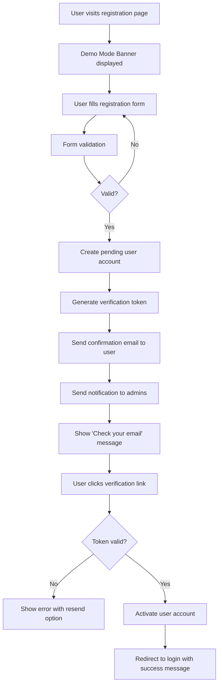
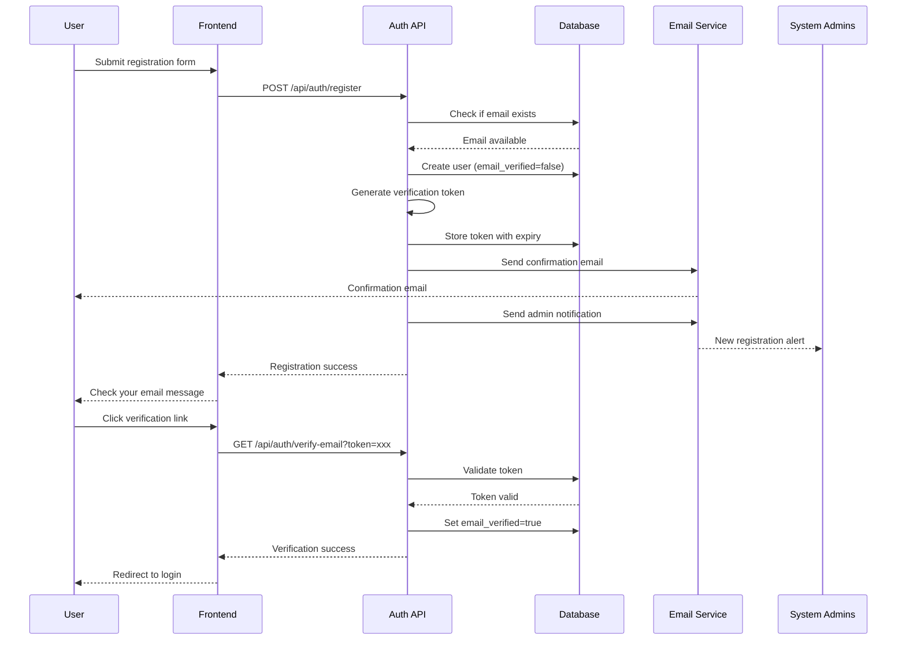

# Email-Verified Registration System Design Document

## Overview

This design document outlines the technical architecture for implementing a secure email-verified user registration system with administrative notifications. The solution adds email verification to the existing authentication flow, ensuring users confirm their email addresses before gaining platform access. It also establishes an automated notification system that alerts system administrators about new registrations, support requests, and sales inquiries.

The design leverages the existing SendGrid email service integration and extends the current user authentication system with minimal disruption to existing functionality.

## Architecture

### High-Level System Flow



### Email Verification Flow



## Components and Interfaces

### Frontend Components

#### 1. RegistrationPage

**Purpose**: User registration interface with demo mode banner
**Location**: `/register`

**Key Features**:

- Demo mode banner with sales contact information
- Registration form with validation
- Password strength indicator
- Email format validation
- Organization information collection

**Props Interface**:

```typescript
interface RegistrationPageProps {
  onRegistrationSuccess: (email: string) => void;
  demoMode?: boolean;
}

interface RegistrationFormData {
  email: string;
  password: string;
  confirmPassword: string;
  username: string;
  organizationName?: string;
}
```

#### 2. DemoModeBanner

**Purpose**: Informational banner about demo status
**Reusable**: Yes

**Key Features**:

- Clear demo mode messaging
- Sales contact call-to-action
- Link to pricing/features
- Professional appearance

**Props Interface**:

```typescript
interface DemoModeBannerProps {
  onContactSales: () => void;
  showPricingLink?: boolean;
}
```

#### 3. EmailVerificationPending

**Purpose**: Post-registration confirmation screen
**Location**: `/verify-email-pending`

**Key Features**:

- Clear instructions to check email
- Resend verification email option
- Support contact information
- Email address display

**Props Interface**:

```typescript
interface EmailVerificationPendingProps {
  email: string;
  onResendEmail: () => Promise<void>;
}
```

#### 4. EmailVerificationSuccess

**Purpose**: Successful verification confirmation
**Location**: `/verify-email-success`

**Key Features**:

- Success message
- Login button
- Welcome messaging

#### 5. EmailVerificationError

**Purpose**: Failed verification handling
**Location**: `/verify-email-error`

**Key Features**:

- Error explanation
- Resend verification option
- Support contact

#### 6. SalesInquiryModal

**Purpose**: Sales contact form
**Reusable**: Yes

**Key Features**:

- Contact information collection
- Inquiry type selection
- Organization details
- Module interest selection

**Props Interface**:

```typescript
interface SalesInquiryModalProps {
  isOpen: boolean;
  onClose: () => void;
  onSubmit: (inquiry: SalesInquiry) => Promise<void>;
}

interface SalesInquiry {
  name: string;
  email: string;
  organization: string;
  organizationSize?: string;
  interestedModules: ModuleType[];
  message: string;
  inquiryType: "pricing" | "demo" | "features" | "other";
}
```

#### 7. SupportRequestModal

**Purpose**: Support request form
**Reusable**: Yes

**Key Features**:

- Issue description
- Urgency level selection
- Attachment support
- Contact information

**Props Interface**:

```typescript
interface SupportRequestModalProps {
  isOpen: boolean;
  onClose: () => void;
  onSubmit: (request: SupportRequest) => Promise<void>;
  userEmail?: string;
}

interface SupportRequest {
  name: string;
  email: string;
  subject: string;
  description: string;
  urgency: "low" | "medium" | "high";
  category: "technical" | "account" | "billing" | "other";
}
```

### Backend Components

#### 1. Email Verification Service

**Purpose**: Handle email verification token generation and validation
**Location**: `apps/server/services/email-verification.ts`

**Key Functions**:

```typescript
interface EmailVerificationService {
  generateVerificationToken(): string;
  hashToken(token: string): string;
  createVerificationLink(token: string, baseUrl: string): string;
  validateToken(token: string, hashedToken: string, expiry: Date): boolean;
  sendVerificationEmail(
    email: string,
    token: string,
    baseUrl: string
  ): Promise<boolean>;
}
```

#### 2. Admin Notification Service

**Purpose**: Send notifications to system administrators
**Location**: `apps/server/services/admin-notifications.ts`

**Key Functions**:

```typescript
interface AdminNotificationService {
  getSystemAdmins(): Promise<User[]>;
  sendRegistrationNotification(user: User): Promise<void>;
  sendSupportRequestNotification(request: SupportRequest): Promise<void>;
  sendSalesInquiryNotification(inquiry: SalesInquiry): Promise<void>;
}
```

#### 3. Enhanced SendGrid Service

**Purpose**: Extended email templates and sending
**Location**: `apps/server/services/sendgrid.ts` (extended)

**New Functions**:

```typescript
interface EnhancedSendGridService {
  generateVerificationEmail(
    email: string,
    token: string,
    baseUrl: string
  ): EmailParams;
  generateAdminRegistrationNotification(user: User): EmailParams;
  generateAdminSupportNotification(request: SupportRequest): EmailParams;
  generateAdminSalesNotification(inquiry: SalesInquiry): EmailParams;
}
```

### API Endpoints

#### Registration Endpoints

**POST /api/auth/register**

- Create new user account with pending verification status
- Generate and send verification email
- Notify system administrators
- Return success message

**GET /api/auth/verify-email**

- Query params: `token` (verification token)
- Validate token and expiry
- Activate user account
- Return success/error status

**POST /api/auth/resend-verification**

- Body: `{ email: string }`
- Generate new verification token
- Send new confirmation email
- Return success message

#### Support and Sales Endpoints

**POST /api/support/request**

- Body: `SupportRequest`
- Validate request data
- Send notification to system admins
- Return confirmation

**POST /api/sales/inquiry**

- Body: `SalesInquiry`
- Validate inquiry data
- Send notification to system admins
- Return confirmation

## Data Models

### Database Schema Extensions

#### Users Table Modifications

```typescript
// Add to existing users table
export const users = pgTable("users", {
  // ... existing fields ...

  // Email verification fields
  emailVerified: boolean("email_verified").notNull().default(false),
  emailVerificationToken: text("email_verification_token"),
  emailVerificationExpiry: timestamp("email_verification_expiry", {
    withTimezone: true,
  }),

  // ... existing fields ...
});
```

#### Support Requests Table (New)

```typescript
export const supportRequests = pgTable("support_requests", {
  id: uuid("id").primaryKey().defaultRandom(),
  name: text("name").notNull(),
  email: text("email").notNull(),
  subject: text("subject").notNull(),
  description: text("description").notNull(),
  urgency: text("urgency").notNull(), // 'low', 'medium', 'high'
  category: text("category").notNull(), // 'technical', 'account', 'billing', 'other'
  status: text("status").notNull().default("open"), // 'open', 'in_progress', 'resolved', 'closed'
  userId: integer("user_id"), // Optional - if user is logged in
  createdAt: timestamp("created_at", { withTimezone: true }).defaultNow(),
  resolvedAt: timestamp("resolved_at", { withTimezone: true }),
});
```

#### Sales Inquiries Table (New)

```typescript
export const salesInquiries = pgTable("sales_inquiries", {
  id: uuid("id").primaryKey().defaultRandom(),
  name: text("name").notNull(),
  email: text("email").notNull(),
  organization: text("organization").notNull(),
  organizationSize: text("organization_size"),
  interestedModules: jsonb("interested_modules").notNull(), // ModuleType[]
  message: text("message").notNull(),
  inquiryType: text("inquiry_type").notNull(), // 'pricing', 'demo', 'features', 'other'
  status: text("status").notNull().default("new"), // 'new', 'contacted', 'qualified', 'converted', 'closed'
  userId: integer("user_id"), // Optional - if user is logged in
  createdAt: timestamp("created_at", { withTimezone: true }).defaultNow(),
  contactedAt: timestamp("contacted_at", { withTimezone: true }),
});
```

### TypeScript Interfaces

```typescript
// Email verification
interface VerificationToken {
  token: string;
  hashedToken: string;
  expiry: Date;
}

interface VerificationEmailData {
  email: string;
  username: string;
  verificationLink: string;
}

// Admin notifications
interface AdminNotification {
  type: "registration" | "support" | "sales";
  recipient: string;
  subject: string;
  data: RegistrationData | SupportRequest | SalesInquiry;
}

interface RegistrationData {
  username: string;
  email: string;
  organizationName?: string;
  registeredAt: Date;
}

// API responses
interface RegistrationResponse {
  success: boolean;
  message: string;
  email: string;
}

interface VerificationResponse {
  success: boolean;
  message: string;
  redirectUrl?: string;
}

interface NotificationResponse {
  success: boolean;
  message: string;
  ticketId?: string; // For support requests
}
```

## User Experience Design

### Visual Design

#### Demo Mode Banner Design

```
┌─────────────────────────────────────────────────────┐
│ ℹ️  Demo Mode                                        │
│ This platform is currently in demonstration mode.   │
│ [Contact Sales] to inquire about purchasing.        │
└─────────────────────────────────────────────────────┘
```

**Styling**:

- Background: Light blue (#E3F2FD)
- Border: Navy blue (#1297D2)
- Icon: Information icon
- Button: Orange accent (#F89E54)
- Padding: 16px
- Border radius: 8px

#### Registration Form Layout

```
┌─────────────────────────────────────────────────────┐
│  [THRIVE Logo]                                      │
│                                                     │
│  Create Your Account                                │
│                                                     │
│  ┌─────────────────────────────────────────────┐   │
│  │ Email *                                     │   │
│  │ [input field]                               │   │
│  │                                             │   │
│  │ Username *                                  │   │
│  │ [input field]                               │   │
│  │                                             │   │
│  │ Password *                                  │   │
│  │ [input field]  [strength indicator]        │   │
│  │                                             │   │
│  │ Confirm Password *                          │   │
│  │ [input field]                               │   │
│  │                                             │   │
│  │ Organization Name (optional)                │   │
│  │ [input field]                               │   │
│  │                                             │   │
│  │ [Create Account Button]                     │   │
│  └─────────────────────────────────────────────┘   │
│                                                     │
│  Already have an account? [Sign In]                │
└─────────────────────────────────────────────────────┘
```

#### Email Verification Pending Screen

```
┌─────────────────────────────────────────────────────┐
│  [THRIVE Logo]                                      │
│                                                     │
│  ✉️  Check Your Email                               │
│                                                     │
│  We've sent a verification link to:                │
│  user@example.com                                   │
│                                                     │
│  Click the link in the email to activate           │
│  your account and start using the platform.        │
│                                                     │
│  Didn't receive the email?                         │
│  [Resend Verification Email]                       │
│                                                     │
│  Need help? [Contact Support]                      │
└─────────────────────────────────────────────────────┘
```

### Email Templates

#### Verification Email Template

**Subject**: Verify your email - THRIVE Assessment Platform

**HTML Content**:

```html
<div
  style="font-family: Arial, sans-serif; max-width: 600px; margin: 0 auto; padding: 20px;"
>
  <div style="text-align: center; margin-bottom: 30px;">
    
  </div>

  <h2 style="color: #1297D2;">Welcome to THRIVE!</h2>

  <p>
    Thank you for registering. Please verify your email address to activate your
    account.
  </p>

  <div style="text-align: center; margin: 30px 0;">
    <a
      href="[VERIFICATION_LINK]"
      style="display: inline-block; padding: 14px 28px; background-color: #F89E54; 
              color: white; text-decoration: none; border-radius: 6px; font-weight: bold;"
    >
      Verify Email Address
    </a>
  </div>

  <p>Or copy and paste this link into your browser:</p>
  <p style="word-break: break-all; color: #6b7280; font-size: 14px;">
    [VERIFICATION_LINK]
  </p>

  <p style="margin-top: 30px;">
    <strong>This link will expire in 24 hours.</strong>
  </p>

  <p>If you didn't create an account, please ignore this email.</p>

  <hr style="margin: 30px 0; border: none; border-top: 1px solid #e5e7eb;" />

  <p style="color: #6b7280; font-size: 14px;">
    Best regards,<br />
    THRIVE Assessment Platform Team
  </p>
</div>
```

#### Admin Registration Notification Template

**Subject**: New User Registration - [Username]

**HTML Content**:

```html
<div
  style="font-family: Arial, sans-serif; max-width: 600px; margin: 0 auto; padding: 20px;"
>
  <h2 style="color: #1297D2;">New User Registration</h2>

  <p>A new user has registered on the THRIVE Assessment Platform.</p>

  <div
    style="background-color: #f3f4f6; padding: 20px; border-radius: 8px; margin: 20px 0;"
  >
    <h3 style="margin-top: 0; color: #1f2937;">User Details</h3>
    <table style="width: 100%; border-collapse: collapse;">
      <tr>
        <td style="padding: 8px 0; font-weight: bold;">Username:</td>
        <td style="padding: 8px 0;">[USERNAME]</td>
      </tr>
      <tr>
        <td style="padding: 8px 0; font-weight: bold;">Email:</td>
        <td style="padding: 8px 0;">[EMAIL]</td>
      </tr>
      <tr>
        <td style="padding: 8px 0; font-weight: bold;">Organization:</td>
        <td style="padding: 8px 0;">[ORGANIZATION]</td>
      </tr>
      <tr>
        <td style="padding: 8px 0; font-weight: bold;">Registered:</td>
        <td style="padding: 8px 0;">[TIMESTAMP]</td>
      </tr>
    </table>
  </div>

  <p>The user will need to verify their email before accessing the platform.</p>

  <hr style="margin: 30px 0; border: none; border-top: 1px solid #e5e7eb;" />

  <p style="color: #6b7280; font-size: 14px;">
    THRIVE Assessment Platform<br />
    Automated Notification
  </p>
</div>
```

#### Admin Support Request Notification Template

**Subject**: Support Request - [Subject]

**HTML Content**:

```html
<div
  style="font-family: Arial, sans-serif; max-width: 600px; margin: 0 auto; padding: 20px;"
>
  <h2 style="color: #1297D2;">New Support Request</h2>

  <div
    style="background-color: #FEF3C7; padding: 12px; border-left: 4px solid #F59E0B; margin: 20px 0;"
  >
    <strong>Urgency: [URGENCY_LEVEL]</strong>
  </div>

  <div
    style="background-color: #f3f4f6; padding: 20px; border-radius: 8px; margin: 20px 0;"
  >
    <h3 style="margin-top: 0; color: #1f2937;">Request Details</h3>
    <table style="width: 100%; border-collapse: collapse;">
      <tr>
        <td style="padding: 8px 0; font-weight: bold;">Name:</td>
        <td style="padding: 8px 0;">[NAME]</td>
      </tr>
      <tr>
        <td style="padding: 8px 0; font-weight: bold;">Email:</td>
        <td style="padding: 8px 0;">[EMAIL]</td>
      </tr>
      <tr>
        <td style="padding: 8px 0; font-weight: bold;">Category:</td>
        <td style="padding: 8px 0;">[CATEGORY]</td>
      </tr>
      <tr>
        <td style="padding: 8px 0; font-weight: bold;">Subject:</td>
        <td style="padding: 8px 0;">[SUBJECT]</td>
      </tr>
      <tr>
        <td style="padding: 8px 0; font-weight: bold;">Submitted:</td>
        <td style="padding: 8px 0;">[TIMESTAMP]</td>
      </tr>
    </table>
  </div>

  <div
    style="background-color: #ffffff; padding: 20px; border: 1px solid #e5e7eb; border-radius: 8px;"
  >
    <h4 style="margin-top: 0;">Description:</h4>
    <p style="white-space: pre-wrap;">[DESCRIPTION]</p>
  </div>

  <hr style="margin: 30px 0; border: none; border-top: 1px solid #e5e7eb;" />

  <p style="color: #6b7280; font-size: 14px;">
    THRIVE Assessment Platform<br />
    Automated Notification
  </p>
</div>
```

#### Admin Sales Inquiry Notification Template

**Subject**: Sales Inquiry - [Organization]

**HTML Content**:

```html
<div
  style="font-family: Arial, sans-serif; max-width: 600px; margin: 0 auto; padding: 20px;"
>
  <h2 style="color: #1297D2;">New Sales Inquiry</h2>

  <div
    style="background-color: #DCFCE7; padding: 12px; border-left: 4px solid #10B981; margin: 20px 0;"
  >
    <strong>Inquiry Type: [INQUIRY_TYPE]</strong>
  </div>

  <div
    style="background-color: #f3f4f6; padding: 20px; border-radius: 8px; margin: 20px 0;"
  >
    <h3 style="margin-top: 0; color: #1f2937;">Contact Information</h3>
    <table style="width: 100%; border-collapse: collapse;">
      <tr>
        <td style="padding: 8px 0; font-weight: bold;">Name:</td>
        <td style="padding: 8px 0;">[NAME]</td>
      </tr>
      <tr>
        <td style="padding: 8px 0; font-weight: bold;">Email:</td>
        <td style="padding: 8px 0;">[EMAIL]</td>
      </tr>
      <tr>
        <td style="padding: 8px 0; font-weight: bold;">Organization:</td>
        <td style="padding: 8px 0;">[ORGANIZATION]</td>
      </tr>
      <tr>
        <td style="padding: 8px 0; font-weight: bold;">Organization Size:</td>
        <td style="padding: 8px 0;">[ORG_SIZE]</td>
      </tr>
      <tr>
        <td style="padding: 8px 0; font-weight: bold;">Interested Modules:</td>
        <td style="padding: 8px 0;">[MODULES]</td>
      </tr>
      <tr>
        <td style="padding: 8px 0; font-weight: bold;">Submitted:</td>
        <td style="padding: 8px 0;">[TIMESTAMP]</td>
      </tr>
    </table>
  </div>

  <div
    style="background-color: #ffffff; padding: 20px; border: 1px solid #e5e7eb; border-radius: 8px;"
  >
    <h4 style="margin-top: 0;">Message:</h4>
    <p style="white-space: pre-wrap;">[MESSAGE]</p>
  </div>

  <hr style="margin: 30px 0; border: none; border-top: 1px solid #e5e7eb;" />

  <p style="color: #6b7280; font-size: 14px;">
    THRIVE Assessment Platform<br />
    Automated Notification
  </p>
</div>
```

## Security Considerations

### Token Generation and Storage

**Token Generation**:

- Use cryptographically secure random token generation (crypto.randomBytes)
- Token length: 32 bytes (64 hex characters)
- Store hashed version in database using bcrypt
- Include timestamp for expiry validation

**Token Security**:

```typescript
import crypto from "crypto";
import bcrypt from "bcryptjs";

function generateVerificationToken(): { token: string; hashedToken: string } {
  const token = crypto.randomBytes(32).toString("hex");
  const hashedToken = bcrypt.hashSync(token, 10);
  return { token, hashedToken };
}
```

### Token Expiry

- Verification tokens expire after 24 hours
- Expired tokens cannot be used
- Users can request new verification emails
- Old tokens are invalidated when new ones are generated

### Rate Limiting

**Registration Endpoint**:

- Maximum 5 registration attempts per IP per hour
- Prevents automated account creation

**Resend Verification Endpoint**:

- Maximum 3 resend requests per email per hour
- Prevents email flooding

**Support/Sales Endpoints**:

- Maximum 10 requests per IP per hour
- Prevents spam submissions

### Email Validation

- RFC 5322 compliant email validation
- Check for disposable email domains (optional)
- Verify email deliverability (optional)
- Prevent duplicate email registrations

### Password Requirements

- Minimum 8 characters
- At least one uppercase letter
- At least one lowercase letter
- At least one number
- At least one special character
- Password strength indicator on frontend

## Error Handling

### Registration Errors

**Duplicate Email**:

```json
{
  "error": "Email already exists",
  "code": "DUPLICATE_EMAIL",
  "message": "An account with this email already exists. Please use a different email or try logging in."
}
```

**Invalid Email Format**:

```json
{
  "error": "Invalid email format",
  "code": "INVALID_EMAIL",
  "message": "Please provide a valid email address."
}
```

**Weak Password**:

```json
{
  "error": "Password does not meet requirements",
  "code": "WEAK_PASSWORD",
  "message": "Password must be at least 8 characters and include uppercase, lowercase, number, and special character."
}
```

### Verification Errors

**Invalid Token**:

```json
{
  "error": "Invalid verification token",
  "code": "INVALID_TOKEN",
  "message": "This verification link is invalid. Please request a new verification email."
}
```

**Expired Token**:

```json
{
  "error": "Verification token expired",
  "code": "EXPIRED_TOKEN",
  "message": "This verification link has expired. Please request a new verification email."
}
```

**Already Verified**:

```json
{
  "error": "Email already verified",
  "code": "ALREADY_VERIFIED",
  "message": "This email address has already been verified. You can log in now."
}
```

### Email Sending Errors

**SendGrid Failure**:

- Log error details
- Return generic success message to user (security)
- Queue retry for failed emails
- Alert system administrators

## Testing Strategy

### Unit Testing

**Components to Test**:

1. **Email Verification Service**

   - Token generation produces unique tokens
   - Token hashing works correctly
   - Token validation accepts valid tokens
   - Token validation rejects invalid/expired tokens
   - Verification link generation is correct

2. **Admin Notification Service**

   - System admin retrieval works
   - Notifications sent to all admins
   - Email templates render correctly
   - Handles missing admin users gracefully

3. **Registration Form Validation**

   - Email format validation
   - Password strength validation
   - Required field validation
   - Duplicate email detection

4. **Email Templates**
   - All placeholders replaced correctly
   - HTML renders properly
   - Links are properly formatted
   - Responsive design works

**Test Coverage Goals**:

- 90%+ coverage for authentication logic
- 85%+ coverage for email services
- 100% coverage for security-related functions

### Integration Testing

**User Flows to Test**:

1. **Complete Registration Flow**

   - User submits registration form
   - Verification email sent
   - Admin notification sent
   - User clicks verification link
   - Account activated successfully
   - User can log in

2. **Resend Verification Flow**

   - User requests resend
   - New token generated
   - Old token invalidated
   - New email sent successfully

3. **Support Request Flow**

   - User submits support request
   - Request saved to database
   - Admin notification sent
   - Confirmation shown to user

4. **Sales Inquiry Flow**
   - User submits sales inquiry
   - Inquiry saved to database
   - Admin notification sent
   - Confirmation shown to user

### End-to-End Testing

**Critical Paths**:

1. New user registration → Email verification → Login
2. Registration → Expired token → Resend → Verification
3. Unverified user login attempt → Error message
4. Support request submission → Admin receives email
5. Sales inquiry submission → Admin receives email

### Security Testing

**Tests to Perform**:

1. **Token Security**

   - Tokens cannot be guessed
   - Expired tokens rejected
   - Used tokens cannot be reused
   - Token brute force prevention

2. **Rate Limiting**

   - Registration rate limits enforced
   - Resend rate limits enforced
   - Support/sales rate limits enforced

3. **Input Validation**

   - SQL injection prevention
   - XSS prevention in forms
   - Email header injection prevention

4. **Authentication**
   - Unverified users cannot log in
   - Session management secure
   - Password requirements enforced

## Performance Optimization

### Email Sending

**Asynchronous Processing**:

- Send emails asynchronously to avoid blocking registration
- Use background job queue (Bull with Redis)
- Retry failed email sends automatically
- Log all email attempts for debugging

**Queue Configuration**:

```typescript
interface EmailJob {
  type: "verification" | "admin_notification" | "support" | "sales";
  recipient: string;
  data: any;
  attempts: number;
  maxAttempts: number;
}

// Queue settings
const emailQueue = new Queue("emails", {
  redis: redisConfig,
  defaultJobOptions: {
    attempts: 3,
    backoff: {
      type: "exponential",
      delay: 2000,
    },
    removeOnComplete: true,
    removeOnFail: false,
  },
});
```

### Database Optimization

**Indexes**:

```sql
-- Email verification lookups
CREATE INDEX idx_users_email_verification_token
ON users(email_verification_token)
WHERE email_verification_token IS NOT NULL;

-- Email uniqueness (already exists)
CREATE UNIQUE INDEX idx_users_email ON users(email);

-- System admin queries
CREATE INDEX idx_users_role ON users(role) WHERE role = 'system_admin';

-- Support request queries
CREATE INDEX idx_support_requests_status ON support_requests(status);
CREATE INDEX idx_support_requests_created_at ON support_requests(created_at DESC);

-- Sales inquiry queries
CREATE INDEX idx_sales_inquiries_status ON sales_inquiries(status);
CREATE INDEX idx_sales_inquiries_created_at ON sales_inquiries(created_at DESC);
```

### Caching Strategy

**System Admin List**:

- Cache system admin email list
- Refresh cache every 5 minutes
- Invalidate on admin role changes

**Email Templates**:

- Pre-compile email templates
- Cache rendered templates
- Invalidate on template updates

## Implementation Considerations

### Environment Variables

Add to `.env`:

```bash
# SendGrid Configuration (already exists)
SENDGRID_API_KEY=your-sendgrid-api-key
SENDGRID_FROM_EMAIL=noreply@thriveiep.com

# Email Verification Settings
EMAIL_VERIFICATION_EXPIRY_HOURS=24
EMAIL_VERIFICATION_BASE_URL=https://your-domain.com

# Rate Limiting
REGISTRATION_RATE_LIMIT=5
RESEND_RATE_LIMIT=3
SUPPORT_RATE_LIMIT=10

# Admin Notifications
ADMIN_NOTIFICATION_ENABLED=true
```

### Migration Strategy

**Database Migration**:

1. Add new columns to users table
2. Create support_requests table
3. Create sales_inquiries table
4. Add indexes
5. Set default values for existing users

**Migration Script**:

```sql
-- Add email verification columns
ALTER TABLE users
ADD COLUMN email_verified BOOLEAN NOT NULL DEFAULT false,
ADD COLUMN email_verification_token TEXT,
ADD COLUMN email_verification_expiry TIMESTAMP WITH TIME ZONE;

-- Mark existing users as verified
UPDATE users SET email_verified = true WHERE created_at < NOW();

-- Create support requests table
CREATE TABLE support_requests (
  id UUID PRIMARY KEY DEFAULT gen_random_uuid(),
  name TEXT NOT NULL,
  email TEXT NOT NULL,
  subject TEXT NOT NULL,
  description TEXT NOT NULL,
  urgency TEXT NOT NULL,
  category TEXT NOT NULL,
  status TEXT NOT NULL DEFAULT 'open',
  user_id INTEGER REFERENCES users(id),
  created_at TIMESTAMP WITH TIME ZONE DEFAULT NOW(),
  resolved_at TIMESTAMP WITH TIME ZONE
);

-- Create sales inquiries table
CREATE TABLE sales_inquiries (
  id UUID PRIMARY KEY DEFAULT gen_random_uuid(),
  name TEXT NOT NULL,
  email TEXT NOT NULL,
  organization TEXT NOT NULL,
  organization_size TEXT,
  interested_modules JSONB NOT NULL,
  message TEXT NOT NULL,
  inquiry_type TEXT NOT NULL,
  status TEXT NOT NULL DEFAULT 'new',
  user_id INTEGER REFERENCES users(id),
  created_at TIMESTAMP WITH TIME ZONE DEFAULT NOW(),
  contacted_at TIMESTAMP WITH TIME ZONE
);

-- Add indexes
CREATE INDEX idx_users_email_verification_token ON users(email_verification_token);
CREATE INDEX idx_users_role ON users(role);
CREATE INDEX idx_support_requests_status ON support_requests(status);
CREATE INDEX idx_sales_inquiries_status ON sales_inquiries(status);
```

### Backward Compatibility

- Existing users marked as email_verified = true
- Login flow checks email_verified status
- Graceful degradation if SendGrid unavailable
- Support for users without email verification

### Monitoring and Logging

**Metrics to Track**:

- Registration success/failure rates
- Email delivery success rates
- Verification completion rates
- Time to verification
- Support request volume
- Sales inquiry volume
- Admin notification delivery

**Logging**:

- All registration attempts
- Email sending attempts and results
- Verification attempts (success/failure)
- Rate limit violations
- Admin notification delivery
- Support/sales submissions

## Deployment Checklist

- [ ] Database migration executed
- [ ] Environment variables configured
- [ ] SendGrid API key verified
- [ ] Email templates tested
- [ ] Rate limiting configured
- [ ] Background job queue running
- [ ] Monitoring alerts configured
- [ ] Admin users notified of new system
- [ ] Documentation updated
- [ ] User communication prepared
