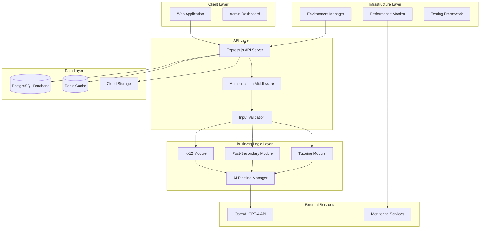

# Platform Enhancement Design Document

## Overview

This design document outlines the architecture and implementation approach for enhancing the AI-powered educational accessibility platform. The platform will be upgraded with comprehensive testing infrastructure, legacy code cleanup (post-Replit migration), performance monitoring, enhanced user experience, security improvements with FERPA and HIPAA compliance preparation, and multi-environment deployment with pathway selection capabilities.

The design focuses on maintaining the existing three-module architecture (K-12, Post-Secondary, Tutoring) while adding robust infrastructure, testing, and operational capabilities to support enterprise-scale deployment. A key architectural decision is the implementation of Simple Analysis Pathway across all environments (development, demo, production) for all three modules, with Complex Analysis Pathway available only in development environment for testing and advanced feature development.

## Architecture

### High-Level System Architecture



### Environment Architecture

The platform will support three distinct environments with different pathway configurations across all three modules (K-12, Post-Secondary, Tutoring):

- **Development Environment**: Full access to both Simple and Complex Analysis Pathways for all modules with pathway selection capability
- **Demo Environment**: Simple Analysis Pathway only for all modules with sample data
- **Production Environment**: Simple Analysis Pathway only for all modules with real user data

**Design Rationale**: This architecture ensures production stability by limiting complex processing to development environments while providing consistent Simple Analysis functionality across all deployment targets. The restriction of Complex Analysis Pathway to development environment allows for safe testing and feature development without impacting production performance or reliability.

## Pathway Deployment Strategy

### Simple Analysis Pathway Deployment

The Simple Analysis Pathway will be deployed across all environments for all three modules (K-12, Post-Secondary, Tutoring) with the following characteristics:

**Development Environment**:

- Full Simple Analysis Pathway functionality for all modules
- Optional Complex Analysis Pathway access for testing and development
- Pathway selection capability through Admin Dashboard
- Complete feature set for development and testing

**Demo Environment**:

- Simple Analysis Pathway only for all modules
- Sample data integration for demonstration purposes
- Restricted to streamlined processing workflows
- No Complex Analysis Pathway access

**Production Environment**:

- Simple Analysis Pathway only for all modules
- Real user data processing
- Optimized for performance and reliability
- No Complex Analysis Pathway access

**Design Rationale**: This deployment strategy ensures production stability by limiting complex processing to development environments while providing consistent core functionality across all deployment targets. The Simple Analysis Pathway provides the essential assessment capabilities needed for production use while maintaining performance and reliability standards.

## Components and Interfaces

### 1. Testing Framework Component

**Purpose**: Comprehensive testing infrastructure ensuring code quality and preventing regressions.

**Key Interfaces**:

- `TestRunner`: Orchestrates test execution across different test types
- `CoverageReporter`: Tracks and reports code coverage metrics
- `E2ETestManager`: Manages Playwright end-to-end test execution
- `ComponentTestSuite`: React Testing Library component test runner

**Implementation Details**:

- Jest for unit testing with 80% minimum coverage requirement
- React Testing Library for component testing
- Playwright for end-to-end testing
- GitHub Actions integration for CI/CD pipeline
- Test result reporting and failure analysis

### 2. Report Editing System Standardization Component

**Purpose**: Deprecates Post-Secondary specific editing system and standardizes all modules to use the K-12 editing system.

**Key Interfaces**:

- `EditingSystemMigrator`: Migrates Post-Secondary reports to use K-12 editing system
- `UnifiedEditorAdapter`: Adapts K-12 editing system for Post-Secondary and Tutoring module requirements
- `LegacyEditorDeprecator`: Removes Post-Secondary specific editing code and components
- `EditingFeatureValidator`: Ensures all editing features work correctly across all modules

**Implementation Details**:

- Migration of existing Post-Secondary reports to use K-12 editing system format
- Extension of K-12 editing system to support Post-Secondary and Tutoring specific requirements
- Removal of Post-Secondary specific editing components and related code
- Validation that all editing features (formatting, sections, export) work across all modules
- User interface consistency across all three modules for editing workflows

**Design Rationale**: Standardizing on a single editing system reduces code duplication, maintenance overhead, and provides a consistent user experience across all modules. The K-12 editing system serves as the foundation due to its maturity and feature completeness.

### 3. Legacy Code Cleanup Component

**Purpose**: Identifies and removes any remaining Replit-specific code and configurations from the platform.

**Key Interfaces**:

- `LegacyCodeScanner`: Scans codebase for Replit-specific references and configurations
- `ConfigurationCleaner`: Removes obsolete environment variables and configuration files
- `DependencyAuditor`: Reviews and updates dependencies that may have Replit-specific configurations
- `DocumentationUpdater`: Updates documentation to reflect post-migration architecture

**Implementation Details**:

- Automated scanning for Replit-specific code patterns and configurations
- Cleanup of obsolete environment variables and configuration references
- Review and update of deployment scripts and CI/CD pipelines
- Documentation updates to reflect current production architecture
- Validation that all functionality works correctly in post-migration environment

**Design Rationale**: Since the Replit migration has been completed, this component ensures complete cleanup of any legacy code or configurations that may still reference the old environment, ensuring a clean and maintainable codebase.

### 4. Performance Monitor Component

**Purpose**: Real-time performance monitoring and optimization tools with proactive bottleneck identification.

**Key Interfaces**:

- `APIMetricsCollector`: Tracks response times for all API endpoints
- `AIProcessingMonitor`: Measures OpenAI API call durations and token usage
- `DatabaseQueryAnalyzer`: Identifies slow queries and optimization opportunities
- `AlertManager`: Manages performance threshold alerts with escalation
- `HealthDashboard`: Provides real-time monitoring dashboards with system health metrics

**Implementation Details**:

- Comprehensive API endpoint response time tracking with percentile analysis
- OpenAI API call duration, token usage, and cost monitoring per module
- Database query performance analysis with slow query identification
- Real-time alerting system with configurable thresholds
- Performance dashboard showing system health, response times, and resource utilization
- Historical performance data retention for trend analysis

**Design Rationale**: The performance monitoring system is designed to provide proactive identification of bottlenecks before they impact users, with specific focus on AI processing costs and database performance optimization opportunities.

### 5. Enhanced User Experience Component

**Purpose**: Improved user interface and interaction patterns across all modules with focus on efficiency, usability, and privacy protection.

**Key Interfaces**:

- `DocumentUploadTracker`: Real-time progress indicators for document upload and processing
- `ExternalRedactionIntegration`: Integration with external redaction service accessed via URL for document deidentification
- `UnifiedReportEditor`: Standardized K-12 editing system for all three modules
- `ReportExportManager`: Enhanced export capabilities with batch processing and multiple formats
- `UserFriendlyErrorHandler`: Actionable error messaging system with guidance
- `AutoSaveManager`: Automatic data persistence functionality with conflict resolution
- `ResponsiveUIManager`: Consistent UI patterns and responsive design across modules

**Implementation Details**:

- Real-time progress indicators for document uploads with processing status updates
- Integration with external redaction service (accessed via URL) for mandatory document deidentification across all modules
- Document handoff to external redaction service and receipt of edited documents back to main platform
- Deprecation of Post-Secondary specific editing system in favor of unified K-12 editing system
- Standardized report editing interface across all three modules (K-12, Post-Secondary, Tutoring)
- Improved export options including batch processing capabilities and multiple format support
- User-friendly error messages with actionable guidance and recovery suggestions
- Auto-save functionality with conflict resolution to prevent data loss
- Consistent UI patterns using design system across all three modules
- Responsive design optimization for various screen sizes and devices

**Design Rationale**: The enhanced UX focuses on reducing user friction during long-running AI processing operations while ensuring privacy protection through mandatory document deidentification via external redaction service. The standardization of the editing system across all modules reduces maintenance overhead and provides a consistent user experience. The K-12 editing system will be extended to support the specific needs of Post-Secondary and Tutoring modules while maintaining a unified interface. The URL-based redaction integration allows for seamless handoff to specialized redaction tools and receipt of processed documents.

### 6. Security and Compliance Component

**Purpose**: Enhanced security features meeting educational data protection requirements with comprehensive audit capabilities.

**Key Interfaces**:

- `RoleBasedAccessController`: Role-based access control enforcement with audit logging
- `ComprehensiveAuditLogger`: Complete audit trail logging for all data access
- `PIIDataEncryption`: Encryption at rest for all personally identifiable information
- `ZodInputValidator`: Comprehensive input validation using Zod schemas for all API requests
- `CustomerDataIsolator`: Multi-tenant customer data isolation enforcement

**Implementation Details**:

- RBAC with granular permissions and comprehensive audit logging
- Complete audit trails for all data access with user attribution and timestamps
- PII data encryption at rest using industry-standard encryption algorithms
- Comprehensive input validation using Zod schemas for all API endpoints
- Customer data isolation enforcement in multi-tenant architecture
- Session-based authentication with secure cookie handling

**Design Rationale**: The security architecture prioritizes educational and healthcare data protection compliance (FERPA and HIPAA) while maintaining usability. The comprehensive audit logging ensures full traceability for compliance audits, and the encryption at rest protects sensitive student and patient information. Long-term compliance with both FERPA and HIPAA standards is a critical business requirement.

### 7. Development Workflow Component

**Purpose**: Improved development tools and code quality enforcement with zero tolerance for violations.

**Key Interfaces**:

- `AutomatedCodeQualityChecker`: Zero-tolerance linting and type checking enforcement
- `PullRequestManager`: Automated review workflow with test passage requirements
- `DatabaseMigrationGenerator`: Versioned database schema migration generation
- `DocumentationManager`: Comprehensive documentation and ADR management
- `CodeReviewAutomator`: Automated feedback and suggested fixes for quality issues

**Implementation Details**:

- ESLint and TypeScript strict mode enforcement with zero tolerance for violations
- Automated code review checks requiring approval and test passage for all pull requests
- Database migration generation and version control using Drizzle ORM
- Comprehensive documentation requirements with automated validation
- Architectural decision record (ADR) management and maintenance
- Detailed feedback and suggested fixes for detected code quality issues

**Design Rationale**: The development workflow enforces high code quality standards to maintain development velocity while ensuring consistent code standards across the team. Zero tolerance for violations ensures technical debt doesn't accumulate.

### 8. Multi-Environment Pathway System

**Purpose**: Manages Simple and Complex Analysis Pathways across different environments.

**Key Interfaces**:

- `PathwaySelector`: Determines available pathways based on environment
- `EnvironmentManager`: Manages environment-specific configurations
- `ModuleRouter`: Routes requests to appropriate module and pathway
- `ConfigurationValidator`: Validates pathway and environment configurations

**Implementation Details**:

- Environment-based pathway restriction logic
- Dynamic pathway selection in development environment
- Module-agnostic pathway implementation
- Configuration management without application restart

### 9. Admin Dashboard Component

**Purpose**: Administrative interface for environment and mode management with real-time configuration capabilities, including prompt and table editing.

**Key Interfaces**:

- `EnvironmentSwitchController`: Controls for switching between development, demo, and production environments
- `PathwaySelectionController`: Pathway selection controls (Simple/Complex - development environment only)
- `PromptEditor`: Database-driven prompt editing interface for system and report prompts (development environment only)
- `TableEditor`: Database table editing interface for configuration management (development environment only)
- `RealTimeSystemStatusProvider`: Real-time environment status, active modules, and pathway configuration display
- `ConfigurationChangeLogger`: Configuration change audit logging with timestamps and user attribution
- `RuntimeConfigurationManager`: Updates system configuration without application restart

**Implementation Details**:

- React-based admin dashboard with real-time updates
- Environment switching controls for development, demo, and production
- Pathway selection between Simple and Complex Analysis (development environment only)
- Prompt editing interface for all six prompts (system and report prompts for each of the three modules) stored in database
- Table editing capabilities for database configuration management in development environment
- Real-time display of environment status, active modules, and current pathway configuration
- Configuration change logging with complete audit trail including timestamps and user attribution
- Runtime configuration updates without requiring application restart
- System health monitoring integration with performance metrics

**Design Rationale**: The admin dashboard provides centralized control over the multi-environment, multi-pathway architecture while maintaining security through proper access controls and comprehensive audit logging. The prompt and table editors are restricted to development environment to prevent accidental changes in production. The database-driven prompt system allows for easy modification of the six prompts (two per module) without code changes.

### 10. Analytics and Reporting Component

**Purpose**: Enhanced analytics capabilities for business insights with comprehensive usage tracking and privacy compliance.

**Key Interfaces**:

- `ModuleUsageTracker`: Tracks usage metrics for each module type (K-12, Post-Secondary, Tutoring)
- `ReportGenerationAnalyzer`: Logs generation times, success rates, and error patterns
- `AIProcessingCostTracker`: Measures token usage, cost tracking, and model performance metrics
- `BusinessIntelligenceDashboard`: Administrative dashboards with key performance indicators
- `PrivacyCompliantDataProcessor`: Ensures user privacy and data anonymization where required

**Implementation Details**:

- Module usage pattern tracking for K-12, Post-Secondary, and Tutoring modules
- Report generation analytics including success rates, failure patterns, and processing times
- OpenAI token usage and cost analysis with detailed breakdown by module and pathway
- Privacy-compliant data anonymization for analytics while maintaining business insights
- Business intelligence dashboard with KPIs including usage trends, cost analysis, and performance metrics
- Data retention policies and automated cleanup for analytics data

**Design Rationale**: The analytics system provides comprehensive business insights while maintaining strict privacy compliance. The module-specific tracking enables data-driven decisions about resource allocation and feature development across the three-module architecture.

## Data Models

### Environment Configuration Model

```typescript
interface EnvironmentConfig {
  id: string;
  name: "development" | "demo" | "production";
  availablePathways: ("simple" | "complex")[];
  activeModules: ("k12" | "post-secondary" | "tutoring")[];
  isActive: boolean;
  createdAt: Date;
  updatedAt: Date;
}
```

### Performance Metrics Model

```typescript
interface PerformanceMetric {
  id: string;
  metricType: "api_response" | "ai_processing" | "database_query";
  endpoint?: string;
  duration: number;
  tokenUsage?: number;
  cost?: number;
  timestamp: Date;
  environment: string;
}
```

### Test Result Model

```typescript
interface TestResult {
  id: string;
  testSuite: string;
  testType: "unit" | "component" | "e2e";
  status: "passed" | "failed" | "skipped";
  coverage?: number;
  duration: number;
  failureReason?: string;
  timestamp: Date;
}
```

### Audit Log Model

```typescript
interface AuditLog {
  id: string;
  userId: string;
  action: string;
  resource: string;
  details: Record<string, any>;
  ipAddress: string;
  userAgent: string;
  timestamp: Date;
}
```

### Document Redaction Model

```typescript
interface DocumentRedaction {
  id: string;
  documentId: string;
  userId: string;
  redactionItems: RedactionItem[];
  isComplete: boolean;
  verificationStatus: "pending" | "verified" | "failed";
  timestamp: Date;
}

interface RedactionItem {
  id: string;
  type: "name" | "ssn" | "dob" | "address" | "phone" | "email" | "custom";
  originalText: string;
  redactedText: string;
  position: { x: number; y: number; width: number; height: number };
  page: number;
}
```

### Prompt Configuration Model

```typescript
interface PromptConfiguration {
  id: string;
  module: "k12" | "post-secondary" | "tutoring";
  promptType: "system" | "report";
  content: string;
  version: number;
  isActive: boolean;
  createdBy: string;
  createdAt: Date;
  updatedAt: Date;
}
```

## Error Handling

### Error Classification System

- **User Errors**: Invalid input, authentication failures, permission denied
- **System Errors**: Database connection issues, external service failures
- **Business Logic Errors**: Validation failures, workflow violations
- **Infrastructure Errors**: Performance issues, resource constraints

### Error Response Strategy

- User-friendly error messages with actionable guidance
- Detailed error logging for debugging purposes
- Error categorization for analytics and monitoring
- Graceful degradation for non-critical failures

### Recovery Mechanisms

- Automatic retry logic for transient failures
- Circuit breaker pattern for external service calls
- Fallback mechanisms for critical functionality
- Data consistency validation and repair

## Testing Strategy

### Unit Testing

- Jest framework with 80% minimum code coverage requirement
- Comprehensive testing of business logic components across all three modules
- Mock external dependencies (OpenAI API, database) for isolated testing
- Test-driven development practices with automated coverage reporting
- Automated test execution blocking deployments on failure

### Component Testing

- React Testing Library for UI component testing across all modules
- User interaction simulation and validation for assessment workflows
- Accessibility testing integration ensuring educational compliance
- Visual regression testing for consistent UI patterns
- Component testing integrated with continuous integration pipeline

### End-to-End Testing

- Playwright for complete workflow testing across all three modules
- Critical user journey validation including document upload, processing, and report generation
- Cross-browser compatibility testing for supported browsers
- Performance testing integration with load time validation
- End-to-end testing for both Simple and Complex Analysis Pathways in development environment

### Integration Testing

- API endpoint testing with real database
- External service integration validation
- Multi-module workflow testing
- Environment-specific configuration testing

### Performance Testing

- Load testing for concurrent user scenarios
- Stress testing for resource limits
- AI processing performance benchmarks
- Database query optimization validation

## Security Considerations

### Authentication and Authorization

- Session-based authentication with secure cookie handling
- Role-based access control with granular permissions
- Multi-factor authentication support
- Session timeout and management

### Data Protection

- Mandatory document deidentification via external redaction service before processing
- Encryption at rest for all PII data
- Secure data transmission using HTTPS/TLS
- Customer data isolation enforcement
- Data retention and deletion policies
- Document redaction audit trails for compliance verification

### Input Validation and Sanitization

- Comprehensive Zod schema validation
- SQL injection prevention
- XSS protection mechanisms
- File upload security validation
- Document deidentification validation from external redaction service before processing
- PII detection and redaction verification from external service integration

### Compliance Requirements

- FERPA compliance for educational data (current requirement)
- HIPAA compliance for healthcare data (long-term strategic requirement)
- GDPR compliance for EU users
- Comprehensive audit trail maintenance for all data access
- Data breach notification procedures for both educational and healthcare contexts
- Business Associate Agreement (BAA) capabilities for HIPAA compliance
- Data retention and deletion policies meeting both FERPA and HIPAA standards

## Performance Optimization

### Database Optimization

- Query optimization and indexing strategy
- Connection pooling and management
- Read replica configuration for scaling
- Database monitoring and alerting

### API Performance

- Response caching strategy
- Rate limiting implementation
- Request/response compression
- API versioning and backward compatibility

### AI Processing Optimization

- Token usage optimization
- Request batching for efficiency
- Response caching for repeated queries
- Cost monitoring and alerting

### Frontend Performance

- Code splitting and lazy loading
- Asset optimization and CDN usage
- Progressive web app features
- Performance monitoring integration

## Deployment Strategy

### Environment Management

- Infrastructure as Code using Terraform/CloudFormation
- Container-based deployment with Docker
- Kubernetes orchestration for scaling
- Blue-green deployment strategy

### CI/CD Pipeline

- Automated testing on all pull requests
- Staged deployment through environments
- Automated rollback capabilities
- Deployment monitoring and validation

### Monitoring and Alerting

- Application performance monitoring
- Infrastructure monitoring
- Business metrics tracking
- Incident response procedures

### Backup and Recovery

- Automated database backups
- Point-in-time recovery capabilities
- Disaster recovery procedures
- Data integrity validation
