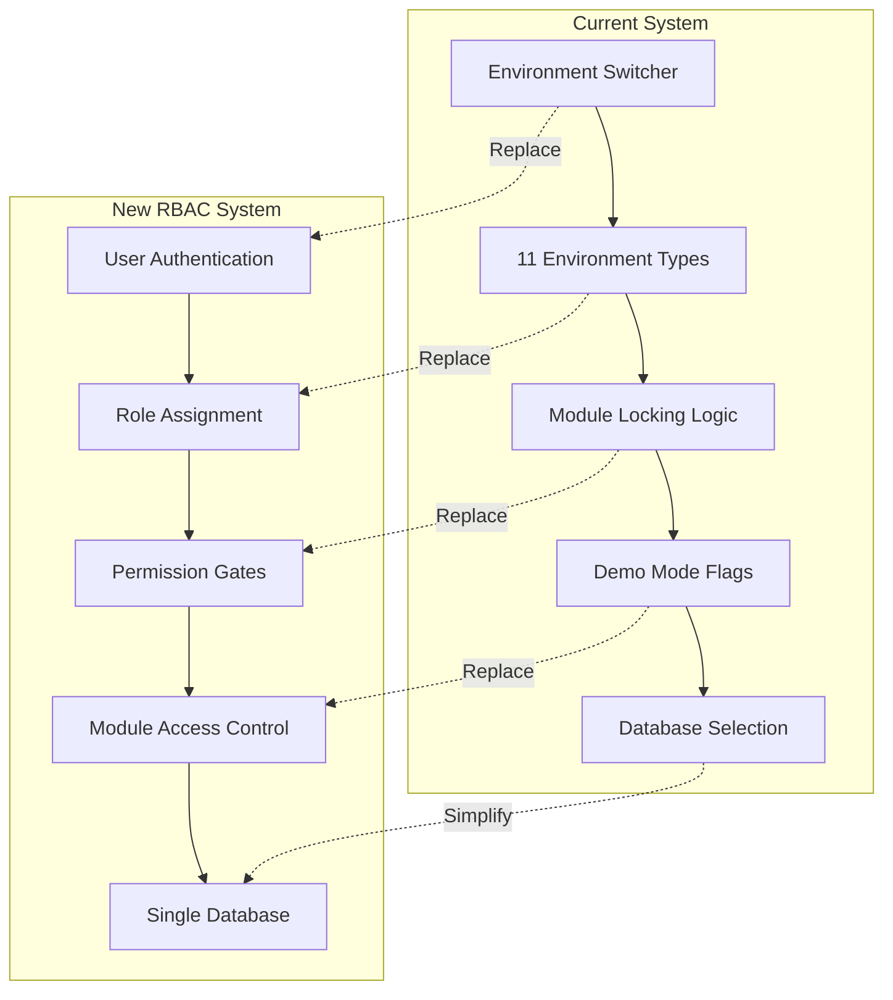

# Design Document

## Overview

This design document outlines the comprehensive transformation of the AI-powered educational accessibility platform from an 11-environment system to a streamlined role-based access control (RBAC) architecture. The redesign eliminates environment switching complexity while maintaining all essential functionality through five distinct user roles and organizational multi-tenancy.

The current system uses environment types (`production`, `replit-prod`, `tutoring`, `development`, `replit-dev`, `post-secondary-dev`, `k12-dev`, `tutoring-dev`, `post-secondary-demo`, `k12-demo`, `tutoring-demo`) with module locking and demo mode flags. This will be replaced with user roles (`Developer`, `Admin`, `Org Admin`, `Customer`, `Demo`) that provide clear permission boundaries and module assignments.

## Architecture

### High-Level Architecture Changes



### Core Components

1. **RBAC System**: Central role-based access control replacing environment logic
2. **Permission Gates**: Middleware components that check user roles before allowing actions
3. **Module Assignment**: User-role-based module access instead of environment locking
4. **Organization Management**: Multi-tenant system supporting customer organizations
5. **Demo Sandbox**: Isolated workspace for demo users with usage limits
6. **Prompt Management**: Git-based version control for AI prompts

## Components and Interfaces

### 1. User Role System

#### Role Definitions

```typescript
export enum UserRole {
  DEVELOPER = "developer",
  ADMIN = "admin",
  ORG_ADMIN = "org_admin",
  CUSTOMER = "customer",
  DEMO = "demo",
}

export interface UserPermissions {
  canSwitchModules: boolean;
  canAccessAdminDashboard: boolean;
  canEditPrompts: boolean;
  canViewAllReports: boolean;
  canManageUsers: boolean;
  canEditSystemConfig: boolean;
  moduleAccess: ModuleType[];
  reportLimit?: number;
}
```

#### Permission Matrix

| Role      | Module Switch | Admin Dashboard | Edit Prompts | View All Reports | Manage Users | Edit System Config | Report Limit |
| --------- | ------------- | --------------- | ------------ | ---------------- | ------------ | ------------------ | ------------ |
| Developer | ✅ All        | ✅ Full         | ✅ Git-based | ✅ All           | ✅ All       | ✅ All             | Unlimited    |
| Admin     | ✅ All        | ✅ Analytics    | ❌           | ✅ All           | ✅ All       | ❌                 | Unlimited    |
| Org Admin | ❌ Assigned   | ❌              | ❌           | ✅ Org only      | ✅ Org only  | ❌                 | Unlimited    |
| Customer  | ❌ Assigned   | ❌              | ❌           | ✅ Own only      | ❌           | ❌                 | Unlimited    |
| Demo      | ❌ Assigned   | ❌              | ❌           | ✅ Own only      | ❌           | ❌                 | 5 reports    |

### 2. Permission Gate System

#### Core Permission Gate Interface

```typescript
export interface PermissionGate {
  checkAccess(user: User, resource: string, action: string): Promise<boolean>;
  enforceAccess(req: Request, res: Response, next: NextFunction): void;
}

export class RBACPermissionGate implements PermissionGate {
  async checkAccess(
    user: User,
    resource: string,
    action: string
  ): Promise<boolean> {
    const permissions = this.getUserPermissions(user.role);
    return this.evaluatePermission(permissions, resource, action);
  }

  enforceAccess(req: Request, res: Response, next: NextFunction): void {
    // Middleware implementation
  }
}
```

#### Permission Gate Types

- **ModuleGate**: Controls access to K-12, Post-Secondary, and Tutoring modules
- **AdminGate**: Controls access to admin dashboards and system monitoring
- **ReportGate**: Controls report creation, viewing, and editing permissions
- **UserManagementGate**: Controls user creation and organization management
- **SystemConfigGate**: Controls access to prompts, AI config, and lookup tables

### 3. Module Assignment System

#### Module Access Control

```typescript
export interface ModuleAssignment {
  userId: number;
  assignedModules: ModuleType[];
  canSwitchModules: boolean;
  organizationId?: string;
}

export enum ModuleType {
  K12 = "k12",
  POST_SECONDARY = "post_secondary",
  TUTORING = "tutoring",
}
```

#### Module Switcher Component

```typescript
export interface ModuleSwitcher {
  availableModules: ModuleType[];
  currentModule: ModuleType;
  canSwitch: boolean;
  switchModule(module: ModuleType): Promise<void>;
}
```

### 4. Organization Management

#### Organization Structure

```typescript
export interface Organization {
  id: string;
  name: string;
  customerId: string; // Maps to existing customerId field
  assignedModules: ModuleType[];
  maxUsers: number;
  isActive: boolean;
  createdAt: Date;
}

export interface OrganizationUser {
  userId: number;
  organizationId: string;
  role: UserRole;
  joinedAt: Date;
  isActive: boolean;
}
```

#### Multi-Tenant Data Isolation

- Reports filtered by organization membership
- User management scoped to organization
- Data sharing within organization boundaries
- Strict isolation between organizations

### 5. Demo Sandbox System

#### Demo User Management

```typescript
export interface DemoSandbox {
  userId: number;
  reportCount: number;
  maxReports: number; // Fixed at 5
  expirationDate: Date;
  autoCleanup: boolean;
  assignedModule: ModuleType;
}

export interface DemoLimits {
  maxReports: 5;
  retentionDays: 30;
  warningThreshold: 4; // Show upgrade prompt at 4th report
}
```

#### Demo Cleanup Process

- Automated cleanup after retention period
- Warning notifications before cleanup
- Upgrade prompts when approaching limits
- Data export options before cleanup

### 6. Prompt Management System

#### Git-Based Prompt Storage

```typescript
export interface PromptFile {
  path: string; // e.g., 'prompts/k12/system-prompt.md'
  module: ModuleType;
  promptType: "system" | "report_format";
  pathwayType: "simple" | "complex";
  version: string;
  content: string;
}

export interface PromptManager {
  loadPromptsFromFiles(): Promise<void>;
  getPrompt(module: ModuleType, type: string, pathway: string): string;
  validatePromptStructure(content: string): boolean;
}
```

#### Prompt File Structure

```
/prompts
  /k12
    system-prompt-simple.md
    system-prompt-complex.md
    report-format-simple.md
    report-format-complex.md
  /post-secondary
    system-prompt-simple.md
    system-prompt-complex.md
    report-format-simple.md
    report-format-complex.md
  /tutoring
    system-prompt-simple.md
    system-prompt-complex.md
    report-format-simple.md
    report-format-complex.md
```

## Data Models

### Updated User Schema

```typescript
export const users = pgTable("users", {
  id: serial("id").primaryKey(),
  username: text("username").notNull().unique(),
  password: text("password").notNull(),
  email: text("email").notNull().unique(),

  // RBAC fields (replacing environment logic)
  role: text("role").notNull().default("customer"), // UserRole enum
  assignedModules: jsonb("assigned_modules").default(["post_secondary"]), // ModuleType[]

  // Organization fields (replacing customerId)
  organizationId: text("organization_id"), // References organizations table

  // Report management
  reportCount: integer("report_count").notNull().default(0),
  maxReports: integer("max_reports").notNull().default(-1), // -1 = unlimited, 5 for demo

  // Status fields
  isActive: boolean("is_active").notNull().default(true),

  // Authentication fields
  resetToken: text("reset_token"),
  resetTokenExpiry: timestamp("reset_token_expiry", { withTimezone: true }),
  registrationToken: text("registration_token"),

  // Timestamps
  createdAt: timestamp("created_at", { withTimezone: true }).defaultNow(),
  lastLogin: timestamp("last_login", { withTimezone: true }),
});
```

### New Organizations Schema

```typescript
export const organizations = pgTable("organizations", {
  id: text("id").primaryKey(), // UUID or custom ID
  name: text("name").notNull(),
  customerId: text("customer_id").notNull().unique(), // Backward compatibility
  assignedModules: jsonb("assigned_modules")
    .notNull()
    .default(["post_secondary"]),
  maxUsers: integer("max_users").notNull().default(10),
  isActive: boolean("is_active").notNull().default(true),
  createdAt: timestamp("created_at", { withTimezone: true }).defaultNow(),
  lastUpdated: timestamp("last_updated", { withTimezone: true }).defaultNow(),
});
```

### Updated Assessment Cases Schema

```typescript
// Remove environment-specific fields, add organization-based filtering
export const assessmentCases = pgTable("assessment_cases", {
  // ... existing fields ...

  // Replace customerId with organizationId for better multi-tenancy
  organizationId: text("organization_id").references(() => organizations.id),
  createdByUserId: integer("created_by_user_id").references(() => users.id),

  // Module assignment (no longer locked by environment)
  moduleType: text("module_type").notNull(),

  // ... rest of existing fields ...
});
```

### Removed Schemas

- Environment-related configuration tables
- Demo permissions JSONB field (replaced by role-based system)
- Environment-specific prompt sections (consolidated into file-based system)

## Error Handling

### Permission Denied Responses

```typescript
export interface PermissionError {
  code: "INSUFFICIENT_PERMISSIONS";
  message: string;
  requiredRole?: UserRole;
  requiredPermission?: string;
  currentRole: UserRole;
}

export interface ModuleAccessError {
  code: "MODULE_ACCESS_DENIED";
  message: string;
  requestedModule: ModuleType;
  assignedModules: ModuleType[];
}

export interface DemoLimitError {
  code: "DEMO_LIMIT_EXCEEDED";
  message: string;
  currentCount: number;
  maxReports: number;
  upgradeUrl: string;
}
```

### Error Handling Strategy

1. **Graceful Degradation**: Show appropriate UI elements based on permissions
2. **Clear Messaging**: Provide specific error messages explaining access restrictions
3. **Upgrade Paths**: Offer clear paths for users to gain additional access
4. **Logging**: Comprehensive audit logging for security and debugging
5. **Fallback Behavior**: Safe defaults when permission checks fail

## Testing Strategy

### Unit Testing

- **Permission Gate Tests**: Verify role-based access control logic
- **Module Assignment Tests**: Test module switching and access restrictions
- **Demo Sandbox Tests**: Validate report limits and cleanup processes
- **Organization Tests**: Test multi-tenant data isolation
- **Prompt Management Tests**: Verify Git-based prompt loading

### Integration Testing

- **Authentication Flow**: End-to-end user authentication and role assignment
- **Module Switching**: Test module access across different user roles
- **Report Management**: Test report creation, sharing, and access control
- **Admin Dashboard**: Test admin functionality across different roles
- **Demo User Journey**: Complete demo user experience from signup to limit

### Migration Testing

- **Data Migration**: Verify existing users are properly migrated to new role system
- **Environment Cleanup**: Ensure all environment-related code is removed
- **Backward Compatibility**: Test that existing reports and data remain accessible
- **Performance Testing**: Verify that RBAC system doesn't impact performance
- **Security Testing**: Validate that permission boundaries are properly enforced

### Test Data Strategy

- **Role-based Test Users**: Create test users for each role type
- **Organization Test Data**: Multi-tenant test scenarios
- **Demo User Scenarios**: Test demo limits and cleanup processes
- **Module Assignment Tests**: Test various module assignment combinations
- **Permission Boundary Tests**: Test edge cases and permission violations

## Implementation Phases

### Phase 1: Foundation (Database & Core RBAC)

- Create organizations table and migrate existing customers
- Update users table with role and module assignment fields
- Implement core permission gate system
- Create role-based middleware components

### Phase 2: Authentication & User Management

- Update authentication system to use roles instead of environments
- Implement organization-based user management
- Create admin interfaces for user and organization management
- Migrate existing users to new role system

### Phase 3: Module Access Control

- Replace environment-based module locking with role-based access
- Implement module switcher component for privileged users
- Update all module-specific routes with permission gates
- Remove environment switching logic

### Phase 4: Demo System & Prompt Management

- Implement demo sandbox with report limits and cleanup
- Migrate prompts from database to Git-based file system
- Create prompt loading and management system
- Update AI service to use file-based prompts

### Phase 5: Cleanup & Testing

- Remove all environment-related code and components
- Comprehensive testing of all role-based functionality
- Performance optimization and security validation
- Documentation and training materials

This design provides a clear roadmap for transforming the complex 11-environment system into a streamlined, maintainable RBAC architecture while preserving all essential functionality and improving the overall user experience.
