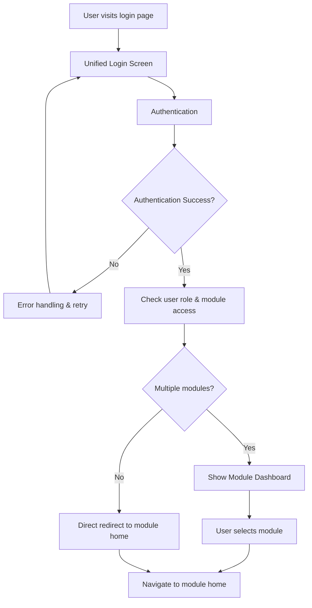
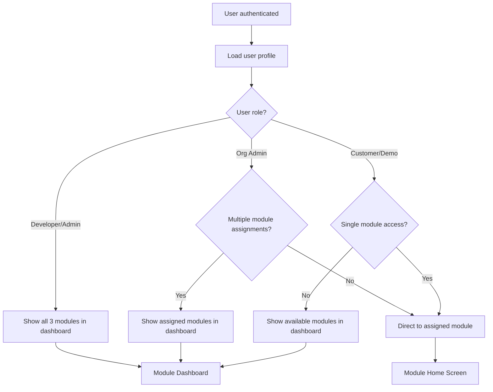

# Unified Login Dashboard Design Document

## Overview

This design document outlines the technical architecture and user experience design for the unified login and dashboard system. The solution replaces module-specific login screens with a clean, professional authentication flow that intelligently routes users based on their role and module access. The design emphasizes the THRIVE brand identity while providing seamless navigation for all user types.

## Architecture

### High-Level System Flow



### Authentication Flow Decision Logic



## Components and Interfaces

### Core Components

#### 1. UnifiedLoginPage

**Purpose**: Module-agnostic authentication interface
**Location**: `/login`

**Key Features**:

- THRIVE branding without module-specific messaging
- Responsive design for all devices
- Security features (rate limiting, validation)
- Clean, professional appearance

**Props Interface**:

```typescript
interface UnifiedLoginPageProps {
  onAuthSuccess: (user: AuthenticatedUser) => void;
  redirectPath?: string;
  theme?: "light" | "dark";
}
```

#### 2. ModuleDashboard

**Purpose**: Module selection interface for multi-module users
**Location**: `/dashboard`

**Key Features**:

- Dynamic module cards based on user permissions
- Administrative quick actions for privileged users
- Recent activity and shortcuts
- Responsive grid layout

**Props Interface**:

```typescript
interface ModuleDashboardProps {
  user: AuthenticatedUser;
  availableModules: ModuleAccess[];
  recentActivity?: RecentActivity[];
  adminFeatures?: AdminFeature[];
}
```

#### 3. ModuleCard

**Purpose**: Individual module representation in dashboard
**Reusable**: Yes

**Key Features**:

- Module-specific branding and icons
- Access status indicators
- Quick stats (report counts, etc.)
- Hover states and animations

**Props Interface**:

```typescript
interface ModuleCardProps {
  module: ModuleInfo;
  accessLevel: "full" | "restricted" | "unavailable";
  stats?: ModuleStats;
  onClick: () => void;
  disabled?: boolean;
}
```

#### 4. AuthenticationGuard

**Purpose**: Route protection and user routing logic
**Type**: Higher-order component

**Key Features**:

- Role-based access control
- Automatic routing decisions
- Session management
- Loading states

### Supporting Components

#### WelcomeHeader

- Personalized greeting based on user role
- Demo status indicators
- Quick access to user settings

#### AdminQuickActions

- System monitoring links
- User management shortcuts
- Configuration access

#### RecentActivity

- Recently accessed modules
- Draft reports and work in progress
- Quick resume functionality

## Data Models

### User Authentication Model

```typescript
interface AuthenticatedUser {
  id: string;
  email: string;
  name: string;
  role: UserRole;
  organizationId?: string;
  moduleAccess: ModuleAccess[];
  preferences: UserPreferences;
  lastLogin: Date;
  demoExpiry?: Date;
}

type UserRole = "Developer" | "Admin" | "Org Admin" | "Customer" | "Demo";

interface ModuleAccess {
  moduleType: "k12" | "post_secondary" | "tutoring";
  accessLevel: "full" | "restricted";
  permissions: Permission[];
}

interface Permission {
  action: string;
  resource: string;
  granted: boolean;
}
```

### Module Information Model

```typescript
interface ModuleInfo {
  id: string;
  name: string;
  displayName: string;
  description: string;
  icon: string;
  color: ThemeColor;
  route: string;
  features: string[];
}

interface ModuleStats {
  totalReports: number;
  draftReports: number;
  recentActivity: Date;
}

type ThemeColor = "navy" | "sky-blue" | "orange" | "yellow";
```

### Navigation State Model

```typescript
interface NavigationState {
  currentPath: string;
  previousPath?: string;
  redirectAfterLogin?: string;
  moduleContext?: string;
}

interface UserPreferences {
  defaultModule?: string;
  dashboardLayout: "grid" | "list";
  theme: "light" | "dark" | "auto";
  notifications: NotificationSettings;
}
```

## User Experience Design

### Visual Design System

#### THRIVE Brand Integration

Based on the existing THRIVE visual identity resources:

**Official THRIVE Color Palette**:

```css
:root {
  --thrive-navy: #1297d2; /* Primary brand color - Navy Blue */
  --thrive-sky-blue: #96d7e1; /* Secondary color - Sky Blue */
  --thrive-orange: #f89e54; /* Accent color - Orange */
  --thrive-yellow: #fde677; /* Highlight color - Yellow */
}
```

**Color Usage Guidelines**:

- **Navy Blue (#1297D2)** - Primary actions, THRIVE logo, main branding elements
- **Sky Blue (#96D7E1)** - Secondary elements, highlights, hover states
- **Orange (#F89E54)** - Accent color, call-to-action buttons, interactions
- **Yellow (#FDE677)** - Active states, selections, notifications

**Typography**:

- Consistent with existing THRIVE brand guidelines
- Clear hierarchy for headings, body text, and UI elements
- Accessible font sizes and contrast ratios

**Available THRIVE Visual Assets**:

- **Custom Figma Icons** - 8 professionally designed navigation icons from THRIVE package
- **Official THRIVE Logo** - Isotype Y-NB variant for branding
- **Illustrations** - Barrier illustration and completion background assets
- **Textures and Backgrounds** - Professional visual elements (4.5MB total assets)
- **Module-specific iconography** - Distinct visual identity for K-12, Post-Secondary, and Tutoring

**Iconography Guidelines**:

- Leverage existing custom Figma icons from THRIVE package
- Module-specific icons for clear identification
- Consistent icon style and sizing across all interfaces
- Professional asset integration from the THRIVE visual identity system

#### Layout Principles

**Login Page Layout**:

```
┌─────────────────────────────────────┐
│  [THRIVE Logo]                      │
│                                     │
│  Sign in to access your             │
│  assessment portal                  │
│                                     │
│  ┌─────────────────────────────┐    │
│  │ Username                    │    │
│  │ [input field]               │    │
│  │                             │    │
│  │ Password                    │    │
│  │ [input field]               │    │
│  │                             │    │
│  │ [Sign In Button]            │    │
│  └─────────────────────────────┘    │
│                                     │
│  Need help? Contact Support        │
└─────────────────────────────────────┘
```

**Module Dashboard Layout**:

```
┌─────────────────────────────────────┐
│ Welcome back, [Name]    [Settings]  │
├─────────────────────────────────────┤
│                                     │
│ ┌─────────┐ ┌─────────┐ ┌─────────┐ │
│ │   K-12  │ │  Post-  │ │Tutoring │ │
│ │ Module  │ │Secondary│ │ Module  │ │
│ │ [icon]  │ │ [icon]  │ │ [icon]  │ │
│ │ 5 rpts  │ │ 12 rpts │ │ 3 rpts  │ │
│ └─────────┘ └─────────┘ └─────────┘ │
│                                     │
│ Recent Activity                     │
│ ┌─────────────────────────────────┐ │
│ │ • Draft report - K-12           │ │
│ │ • Completed - Post-Secondary    │ │
│ └─────────────────────────────────┘ │
└─────────────────────────────────────┘
```

### Responsive Design Strategy

#### Mobile-First Approach

- Touch-friendly interface elements (minimum 44px touch targets)
- Simplified navigation for smaller screens
- Optimized form layouts for mobile keyboards
- Swipe gestures for module cards

#### Breakpoint Strategy

```css
/* Mobile: 320px - 768px */
.module-dashboard {
  grid-template-columns: 1fr;
  gap: 1rem;
}

/* Tablet: 768px - 1024px */
@media (min-width: 768px) {
  .module-dashboard {
    grid-template-columns: repeat(2, 1fr);
    gap: 1.5rem;
  }
}

/* Desktop: 1024px+ */
@media (min-width: 1024px) {
  .module-dashboard {
    grid-template-columns: repeat(3, 1fr);
    gap: 2rem;
  }
}
```

## Error Handling

### Authentication Errors

- Invalid credentials: Clear messaging with retry options
- Account locked: Contact support information
- Network errors: Offline indicators and retry mechanisms
- Session expired: Automatic redirect to login with context preservation

### Authorization Errors

- Insufficient permissions: Upgrade prompts for demo users
- Module access denied: Clear explanation and contact options
- Organization restrictions: Admin contact information

### User Experience Errors

- Loading states: Skeleton screens and progress indicators
- Empty states: Helpful messaging and next steps
- Network connectivity: Offline mode indicators

## Testing Strategy

### Unit Testing

**Components to Test**:

- UnifiedLoginPage: Form validation, submission handling
- ModuleDashboard: Module filtering, user role handling
- ModuleCard: Interaction states, accessibility
- AuthenticationGuard: Route protection logic

**Test Coverage Goals**:

- 90%+ coverage for authentication logic
- 85%+ coverage for UI components
- 100% coverage for security-related functions

### Integration Testing

**User Flows to Test**:

1. Complete login flow for each user role
2. Module selection and navigation
3. Direct module routing for single-access users
4. Error handling and recovery scenarios

### End-to-End Testing

**Critical Paths**:

1. Developer login → Dashboard → Module selection
2. Customer login → Direct module access
3. Demo user login → Module access with limitations
4. Failed login → Error handling → Successful retry

### Accessibility Testing

**Requirements**:

- WCAG 2.1 AA compliance
- Screen reader compatibility
- Keyboard navigation support
- Color contrast validation
- Focus management testing

## Security Considerations

### Authentication Security

- Secure session management with appropriate timeouts
- Rate limiting on login attempts
- CSRF protection on all forms
- Secure password requirements and validation

### Authorization Security

- Role-based access control validation on every request
- Module access verification before routing
- Organization data isolation enforcement
- Audit logging for all authentication events

### Data Protection

- Secure transmission of authentication data
- Proper session token handling
- User preference data encryption
- Compliance with educational data protection requirements

## Performance Optimization

### Loading Performance

- Lazy loading of module-specific assets
- Optimized image assets with appropriate formats
- Minimal JavaScript bundle for login page
- Progressive enhancement for dashboard features

### Runtime Performance

- Efficient user role checking algorithms
- Cached module access permissions
- Optimized re-renders with React optimization techniques
- Debounced user input handling

### Caching Strategy

- Browser caching for static assets
- Session storage for user preferences
- Local storage for non-sensitive user settings
- Server-side caching for user permissions

## Implementation Considerations

### Integration with Existing Systems

- Compatibility with current authentication system
- Integration with existing user role management
- Preservation of current module routing
- Backward compatibility during transition period

### Migration Strategy

- Phased rollout approach
- Feature flags for gradual deployment
- Fallback mechanisms to current system
- User communication and training plan

### Monitoring and Analytics

- Authentication success/failure rates
- Module selection patterns
- User journey analytics
- Performance monitoring and alerting
